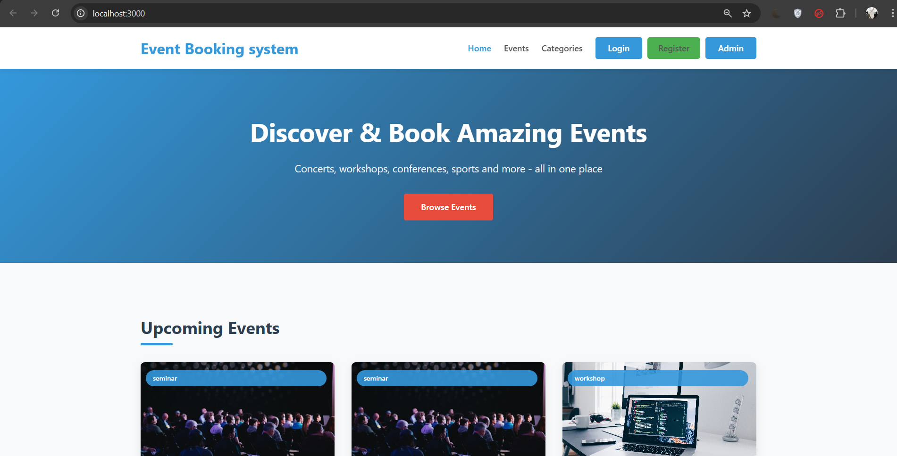
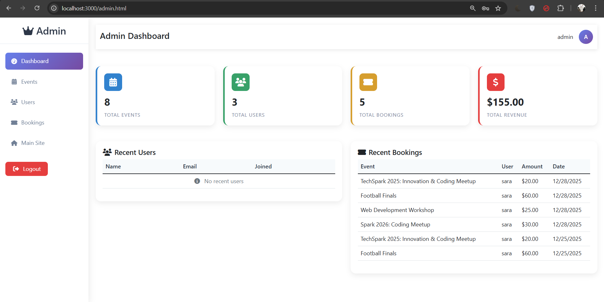

# 🎟️ Online Event Booking System

A full-stack **Online Event Booking System** developed as part of **Task 3**.
This web application allows users to browse events, view details, book tickets, manage bookings, and provides an admin panel for managing events and users with secure authentication.

---

## 📸 Screenshots

### Home Page



### Events Listing Page


### User Dashboard


### Admin Panel



---

## 📖 Project Description

The **Online Event Booking System** is a database-driven full-stack web application built using **Node.js, Express.js, MySQL, and JWT authentication**.
It enables users to explore upcoming events such as concerts, workshops, conferences, and sports events, book tickets securely, and track their booking history.

The admin panel allows administrators to create, update, and delete events, manage users, and monitor bookings and revenue statistics.

This project demonstrates practical implementation of **authentication, authorization, REST APIs, database transactions, and role-based access control**.

---

## ✨ Features

### User Module

* User registration and login
* Secure JWT-based authentication
* Browse upcoming and ongoing events
* View event details
* Book tickets for events
* View booking history
* Cancel bookings with ticket rollback and refund status
* User dashboard with booking statistics

### Admin Module

* Secure admin login
* Create new events
* Update and delete events
* Manage users
* View all bookings
* Admin dashboard with:

  * Total events
  * Total users
  * Total bookings
  * Revenue statistics

---

## 🛠 Technologies Used

### Backend

* Node.js
* Express.js
* MySQL
* JWT (JSON Web Token)
* bcryptjs

### Frontend

* HTML5
* CSS3
* JavaScript (Vanilla JS)
* Font Awesome

### Tools

* phpMyAdmin
* VS Code

---

## 📂 Project Structure

```
EVENT-BOOKING-SYSTEM/
│
├── css/
│   ├── admin.css
│   ├── eventdetail.css
│   └── style.css
│
├── js/
│   ├── app.js         
│   ├── dashboard.js   
│   └── event.js        
│
├── node_modules/
│
├── .env
├── admin.html
├── admin.js
├── adminlogin.html
├── dashboard.html
├── event-details.html
├── index.html
├── login.html
├── register.html
├── package.json
├── package-lock.json
├── README.md
└── server.js
```
---

## 🗄 Database Design

The application uses a **MySQL database** with the following tables:

* `users` – stores user and admin account details
* `events` – stores event information
* `event_categories` – stores event categories
* `bookings` – stores event bookings
* `payments` – stores payment and transaction details

### Database Highlights

* Role-based users (admin & normal users)
* Event-wise ticket availability management
* Transaction-safe booking and cancellation
* Revenue calculation queries for admin dashboard

The complete SQL schema is included in
`database/event_booking_system.sql`.

---

## ⚙️ Environment Variables

Create a `.env` file in the root directory:

```env
JWT_SECRET=your-super-secret-jwt-key-change-this-in-production
PORT=3000
DB_HOST=localhost
DB_USER=root
DB_PASSWORD=
DB_NAME=event_booking_system
```

---

## ▶ How to Run the Project

### 1️⃣ Clone the Repository

```bash
git clone https://github.com/your-username/event-booking-system.git
cd event-booking-system
```

### 2️⃣ Install Dependencies

```bash
npm install
```

### 3️⃣ Setup Database

* Open **phpMyAdmin**
* Create a database named `event_booking_system`
* Import `database/event_booking_system.sql`

### 4️⃣ Start the Server

```bash
node server.js
```

Server will run at:

```
http://localhost:3000
```

---

## 🔐 Authentication & Security

* Passwords are securely hashed using **bcrypt**
* JWT-based authentication
* Protected API routes using middleware
* Role-based access control (User & Admin)
* Secure booking transactions using database locks

---

## 📡 API Overview

| Method | Endpoint                   | Description            |
| ------ | -------------------------- | ---------------------- |
| POST   | `/api/register`            | User registration      |
| POST   | `/api/login`               | User login             |
| GET    | `/api/events`              | Get all events         |
| GET    | `/api/events/:id`          | Get event details      |
| POST   | `/api/bookings`            | Book tickets           |
| GET    | `/api/user/bookings`       | View user bookings     |
| PUT    | `/api/bookings/:id/cancel` | Cancel booking         |
| POST   | `/api/admin/login`         | Admin login            |
| GET    | `/api/admin/events`        | Admin event management |
| POST   | `/api/admin/events`        | Create event           |
| PUT    | `/api/admin/events/:id`    | Update event           |
| DELETE | `/api/admin/events/:id`    | Delete event           |

---

## 📚 Learning Outcomes

* Full-stack web application development
* RESTful API design
* JWT authentication & authorization
* Secure password handling
* Database transactions and locking
* Role-based access control
* Real-world event booking logic

---

## 👩‍💻 Developed By

**Girisaa Priyadharsini M**
Task 3 – Online Event Booking System

---

## 📄 License

This project is developed for **educational and internship purposes only**.

---
